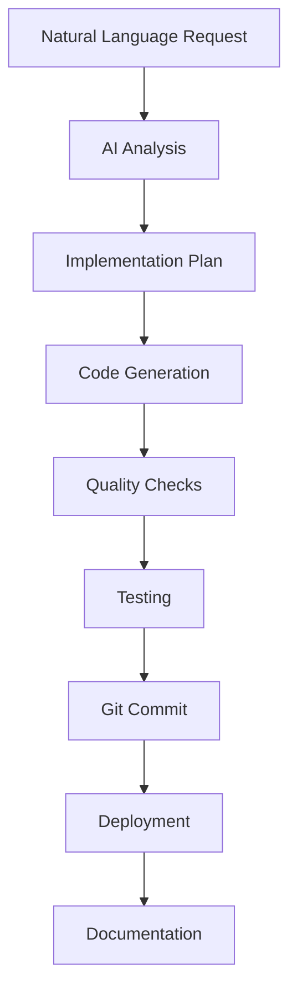

# 🤖 Prism Auto - Development Automation System

> **AI-Powered Development Workflow Automation for Prism Writing**

Transform natural language requests into fully implemented features, from code generation to deployment, in seconds.

## ✨ What is Prism Auto?

Prism Auto is an intelligent automation system that takes natural language development requests and:

1. **🔍 Analyzes** your request using AI (Claude/GPT)
2. **🏗️ Generates** production-ready code
3. **🧪 Tests** the implementation 
4. **💾 Commits** changes to git
5. **🚀 Deploys** to production
6. **📝 Documents** the changes

All automatically, while you grab coffee ☕

## 🚀 Quick Start

### 1. Setup (One-time)

```bash
# Clone or navigate to your Prism Writing project
cd prism-writing-website

# Run the setup script
chmod +x automation/setup.sh
./automation/setup.sh

# Add your AI API key to .env
echo "ANTHROPIC_API_KEY=your_key_here" >> .env
```

### 2. Usage

```bash
# Create new features
prism-auto "create a new testimonials page with customer reviews"

# Fix issues
prism-auto "fix the mobile navigation menu styling"

# Add components
prism-auto "add a contact form with email validation"

# Enhance existing features
prism-auto "improve the portfolio page with filtering"

# Analyze first (preview mode)
prism-auto --analyze-only "implement user authentication"
```

## 🎯 What Can It Do?

### ✅ Supported Request Types

| Type | Example Request | What It Does |
|------|----------------|--------------|
| **New Pages** | `"create a new about page with team info"` | Generates complete page with navigation, content, styling |
| **Components** | `"add a testimonial carousel component"` | Creates reusable React components with TypeScript |
| **Bug Fixes** | `"fix mobile menu not closing on click"` | Analyzes and fixes specific issues |
| **Enhancements** | `"improve portfolio with image lazy loading"` | Enhances existing features |
| **Styling** | `"update hero section with gradient background"` | Modifies CSS/Tailwind styles |
| **Forms** | `"add contact form with validation"` | Creates forms with proper validation |

### 🏗️ Generated Code Quality

- ✅ **TypeScript** interfaces and proper typing
- ✅ **Responsive design** with Tailwind CSS
- ✅ **Dark/light mode** support
- ✅ **Accessibility** best practices
- ✅ **SEO optimization** for pages
- ✅ **Error handling** and loading states
- ✅ **Performance optimization**

## 🛠️ How It Works



### Detailed Workflow

1. **🧠 AI Analysis**
   - Parses your request using Claude/GPT
   - Identifies components, files, and dependencies needed
   - Creates step-by-step implementation plan

2. **🏗️ Code Generation**
   - Generates TypeScript components and pages
   - Follows project conventions and patterns
   - Integrates with existing codebase

3. **🧪 Quality Assurance**
   - Runs TypeScript type checking
   - Performs linting (ESLint)
   - Executes build tests
   - Validates code structure

4. **💾 Version Control**
   - Stages all changes
   - Creates descriptive commit messages
   - Optionally pushes to remote

5. **🚀 Deployment**
   - Deploys to Vercel production
   - Updates live site at prismwriting.com
   - Provides deployment URLs

6. **📝 Documentation**
   - Generates implementation reports
   - Creates workflow logs
   - Updates project documentation

## ⚙️ Configuration

Edit `automation-config.yaml` to customize:

```yaml
# AI Provider Settings
ai_assistant:
  model: "claude-3-5-sonnet"
  confidence_threshold: 0.8

# Automation Preferences  
automation:
  auto_commit: true
  auto_deploy: true
  run_tests: true
  generate_docs: true

# Quality Gates
quality_gates:
  max_build_time_minutes: 5
  max_lint_errors: 0
  min_lighthouse_score: 90
```

## 📋 Command Reference

### Basic Usage
```bash
prism-auto "your request here"
```

### Options
```bash
--analyze-only      # Preview what would be done
--skip-tests       # Skip running tests  
--skip-deploy      # Skip deployment
--skip-commit      # Skip git commit
--dry-run          # Show plan without execution
--verbose          # Detailed output
--help-detailed    # Comprehensive help
```

### Examples

#### Page Creation
```bash
prism-auto "create a new services page with pricing tiers"
prism-auto "add a blog page with article listings"
prism-auto "build a team page with member profiles"
```

#### Component Development
```bash
prism-auto "create a testimonial slider component"
prism-auto "add a newsletter signup widget"
prism-auto "build a FAQ accordion component"
```

#### Bug Fixes
```bash
prism-auto "fix the footer not sticking to bottom"
prism-auto "resolve mobile menu overlay issues"
prism-auto "fix form validation error messages"
```

#### Enhancements
```bash
prism-auto "add loading animations to the portfolio"
prism-auto "improve homepage hero with video background"
prism-auto "enhance contact form with better UX"
```

## 🔧 Advanced Features

### Custom Templates
Define your own component/page templates in `automation-config.yaml`:

```yaml
file_templates:
  component: |
    'use client'
    interface {ComponentName}Props {
      // Props here
    }
    export default function {ComponentName}() {
      return <div>Component content</div>;
    }
```

### Integration Hooks
Add custom scripts to run at different workflow stages:

```yaml
hooks:
  pre_implementation: "npm run pre-build"
  post_testing: "npm run notify-team"
  post_deployment: "npm run update-analytics"
```

### Multiple AI Providers
Switch between AI providers:

```bash
# Use Claude (default)
prism-auto "create new page"

# Use OpenAI GPT
PRISM_AI_PROVIDER=openai prism-auto "create new page"
```

## 📊 Monitoring & Logs

### View Logs
```bash
# Real-time automation log
tail -f automation/automation.log

# Workflow results
cat workflow_20240627_143022.json

# Implementation reports  
cat implementation_20240627_143022.md
```

### Analytics Dashboard
Access automation analytics:
- Request success rates
- Average implementation time
- Most common request types
- Error patterns and fixes

## 🔒 Security & Best Practices

### API Key Management
```bash
# Required: AI service key
ANTHROPIC_API_KEY=your_key_here

# Optional: Enhanced features
GITHUB_TOKEN=your_token_here
VERCEL_TOKEN=your_token_here
```

### Safe Automation
- All changes are committed to git (easy rollback)
- Tests run before deployment
- Dry-run mode for previewing changes
- Quality gates prevent bad deployments

### Code Review
Even with automation, review generated code:
```bash
# Preview changes before deployment
prism-auto --analyze-only "your request"

# Review generated code
git diff HEAD~1
```

## 🚨 Troubleshooting

### Common Issues

**❌ "API key not found"**
```bash
# Check your .env file
cat .env | grep ANTHROPIC_API_KEY
```

**❌ "Build failed"**
```bash
# Check build logs
npm run build
```

**❌ "Tests failing"**
```bash
# Skip tests temporarily
prism-auto --skip-tests "your request"
```

**❌ "Deployment failed"**
```bash
# Check Vercel status
npx vercel --help
```

### Debug Mode
```bash
# Verbose output
prism-auto --verbose "your request"

# Check automation logs
tail -f automation/automation.log
```

### Reset & Recovery
```bash
# Reset automation state
rm automation/workflow_*.json
rm automation/analysis_*.json

# Clean build cache
rm -rf .next
npm run build
```

## 🤝 Contributing

### Adding New Request Types
1. Edit `automation-config.yaml` request patterns
2. Add templates for new file types  
3. Update AI prompt engineering
4. Test with various request phrasings

### Improving AI Prompts
Enhance the AI's understanding by updating prompts in:
- `ai_integration.py` - Core AI interaction logic
- `automation-config.yaml` - Request pattern matching

### Adding Integrations
- **Slack notifications**: Add webhook URL to config
- **Discord updates**: Configure Discord integration
- **Email reports**: Set up email notification system

## 📈 Roadmap

### Version 1.0 (Current)
- ✅ Natural language request processing
- ✅ Code generation with AI
- ✅ Automated testing and deployment
- ✅ Git integration

### Version 1.1 (Coming Soon)
- 🔄 Visual diff previews
- 🔄 Rollback automation
- 🔄 Performance monitoring
- 🔄 Team collaboration features

### Version 2.0 (Future)
- 🔮 Visual design generation
- 🔮 Database schema automation
- 🔮 API endpoint generation
- 🔮 Full-stack feature automation

## 📞 Support

### Getting Help
- **Documentation**: `prism-auto --help-detailed`
- **Logs**: `automation/automation.log`
- **Issues**: Check workflow JSON files
- **Community**: [GitHub Discussions](https://github.com/prism-writing/automation/discussions)

### Reporting Bugs
Include in your report:
1. Request that failed
2. Automation logs
3. Error messages
4. Project configuration

---

## 🎉 Success Stories

> *"Went from idea to deployed feature in under 2 minutes. Prism Auto generated a complete testimonials page with proper TypeScript types, responsive design, and dark mode support!"*

> *"Fixed a complex mobile navigation bug by just describing the issue. The AI understood the problem and generated the perfect fix."*

> *"Built an entire contact form with validation, error handling, and email integration. All I said was 'add contact form with validation' and it was done."*

---

**Ready to automate your development workflow?**

```bash
prism-auto "create something amazing"
```

*Built with ❤️ for the Prism Writing team*
